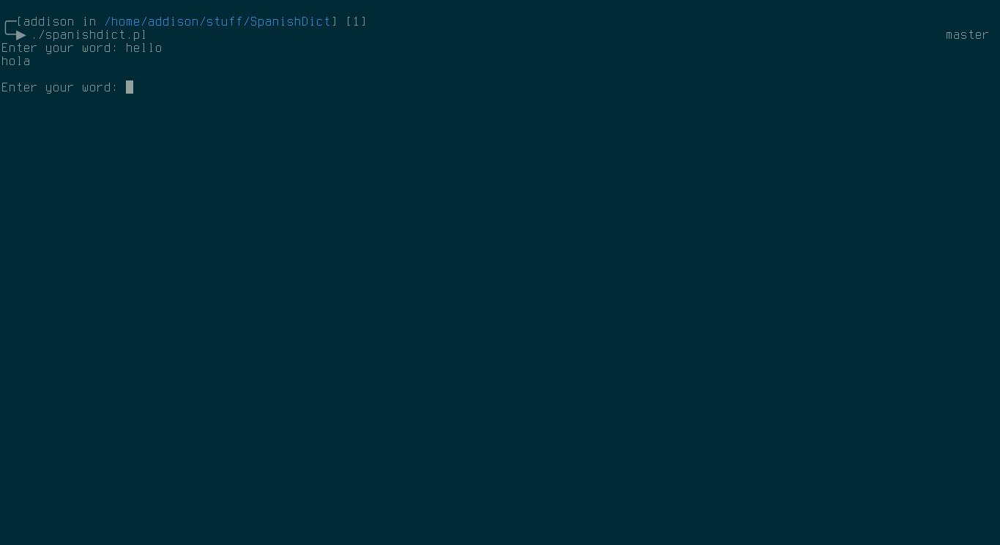

SpanishDict in Terminal
=======================

I do not mean to infringe on any intellectual property of SpanishDict; This code was just meant for me to be able to access the SpanishDict definitions from my command line.

Overview
--------

This program basically curls the SpanishDict website for the specified word, parses the html for the definition, and displays it. It's a bit rough around the edges as it doesn't support unicode properly, so the definitions might not be 100% correct.

Screenshots
-----------

